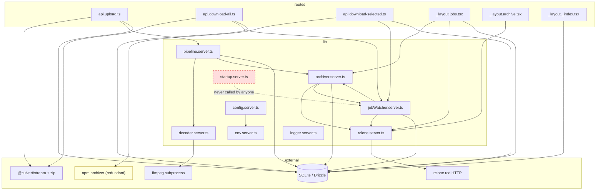
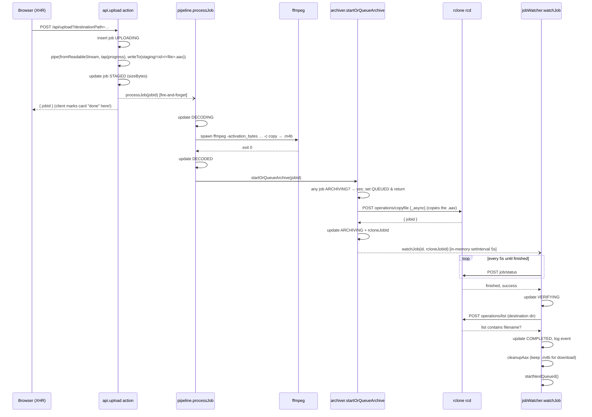
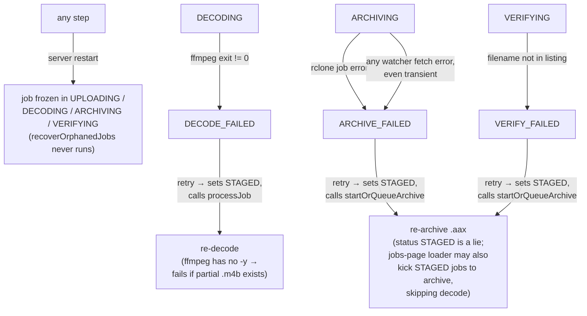
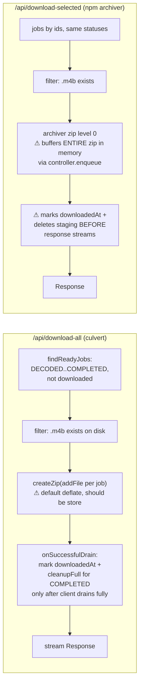
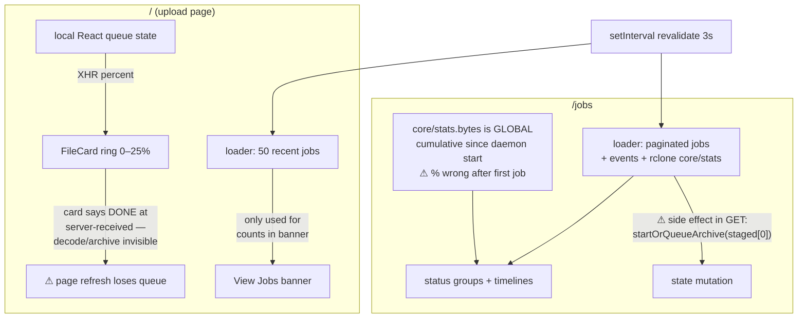

# Callgraphs

_Audit date: 2026-08-06. Mermaid diagrams — GitHub renders these natively._

## 1. Module dependency graph

Notes:
- `startup.server.ts` (crash recovery) and `config.validateConfig()` have **no
  callers** — the red dashed node is dead code.
- `archiver.server.ts ↔ jobWatcher.server.ts` is a genuine cycle, papered over
  with a dynamic `import()` of `rclone.server` inside `archiver.server.ts`.
- Two ZIP implementations coexist (`@culvert/zip` in download-all, npm
  `archiver` in download-selected).

## 2. Upload → decode → archive pipeline (happy path)

The dotted async arrows are the fragile joints: `processJob` and `watchJob`
survive only as long as the Node process does, and nothing reconstructs them
after a restart (recovery module is never wired).

## 3. Failure & retry paths

## 4. Download flows

## 5. UI data flow (the progress split-brain)

The ProgressRing component supports `ARCHIVING/VERIFYING/COMPLETED` stages,
but the upload page only ever feeds it local XHR state — the server pipeline
stages are dead UI states. That is the root of the "data pipeline across
pages" pain.
